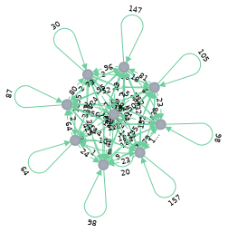

# Language Modeling

This part attempts to provide language models that will help other NLP projects use the Kurdish Language

As a first step, Neo4j is used to graph the database to study common patterns.

Here are few results so far.

